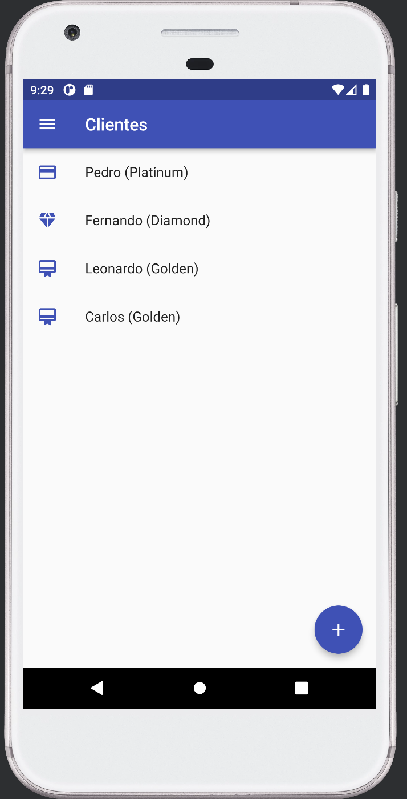

# Flutter: Gerenciamento de estados complexos

Esse curso de Flutter vai te ensinar a: 

-> O que é estado e gerenciadores de estados

-> Como instalar e utilizar o Provider como gerenciador de estados

-> Formular estados seguindo o conceito de single source of truth

-> Como organizar models que utilizam os conceitos do `change notifier`

-> Criar Widgets focados em estado e passagem de dados

## 🔨 Projeto: Client Control

O projeto do curso consiste em um gerenciamento de clientes de maneira que podemos cadastrar clientes, tipos de clientes e vincular os tipos cadastrados com os clientes utilizando abordagens de gerenciamento de estados.

## ✔️ Técnicas e tecnologias

**Veja mais de perto o que você aprenderá sobre** :
- `Provider`: Você aprenderá o que é o provider e o seu poder como gerenciador de estados.
- `Consumer`: Leia dados da única fonte da verdade através do Widget Consumer. 
- `Provider.of`: Entenda como acessar valores de estado fora da árvore de Widgets.
- `ChangeNotifier`: Possibilita preparar uma model para trabalhar como única fonte da verdade.
- `notifyListeners()`: Notifica as escutas de alterações no estado e notifica ao componente o novo estado.
- `MultiProvider`: É responsável por prover um meio de gerenciar multiplos providers na árvore de Widgets do projeto.
- `Redux`: Entenda os conceitos e princípios dos gerenciadores com base no Redux.
- `BloC`: Veja como funciona a teoria dos gerenciadores que implementam o padrão BloC.

 

## 🛠️ Abrir e rodar o projeto

**Para executar este projeto você precisa:**

- Ter uma IDE, que pode ser o  [Android Studio](https://developer.android.com/) instalado na sua máquina
- Ter a [SDK do Flutter](https://docs.flutter.dev/get-started/install) na versão 3.0.0

## 📚 Mais informações do curso

Gostou do projeto e quer conhecer mais? Você pode [acessar o curso]() que desenvolve o projeto desde o começo!

Esse curso faz parte da [formação de Flutter da Alura](https://cursos.alura.com.br/formacao-flutter)

Entender para quem é este curso, qual é o conteúdo proposto e como ele funcionará no vídeo apresentação;

Como baixar nosso projeto do curso, a utilidade e como funciona o app ao acessarmos as telas e código no vídeo controle de clientes;

Identificar a importância do estado da aplicação e como realizar corrigir o alerta de alteração do estado de maneira que qualquer alteração seja refletida para o usuário no 
vídeo gerenciando estados;

Saber a importância de chamar o setState quando uma nova alteração for feita no estado visando a comunicar ao Flutter que houve alguma mudança, no vídeo gerenciando estados.